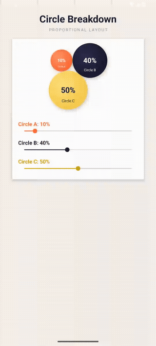

# CircleLayout — Android Proportional Circle View

A custom Android View that renders **three mutually adjacent circles** whose sizes scale proportionally to given percentages. All three circles always touch each other (triangle formation), and interactive SeekBars let you adjust each percentage in real time.

---

## Demo



> Drag any SeekBar to watch all three circles resize in real time while staying mutually adjacent.

---

## Features

- **Proportional sizing** — circle area scales with percentage (e.g. 50% circle has 5× the area of a 10% circle)
- **Mutually adjacent** — all three circles touch each other using triangle geometry (not a straight line)
- **Minimum visible size** — even at 0%, a circle is still rendered at a minimum size
- **Live SeekBars** — drag any of the three sliders and all three update instantly, always summing to 100%
- **Radial gradient + shadow** — polished look with depth using `RadialGradient` and `BlurMaskFilter`
- **Auto-scaling** — the circle group scales to fit any view size

---

## Project Structure

```
app/src/main/
├── java/com/example/circlelayout/
│   ├── CirclePercentageView.kt   # Custom View — all drawing & geometry logic
│   └── MainActivity.kt           # Activity — SeekBar controls and sync logic
└── res/layout/
    └── activity_main.xml         # Layout — CirclePercentageView + 3 SeekBars
```

---

## Getting Started

### Requirements

- Android Studio Hedgehog or later
- `minSdk 21`
- Kotlin 1.8+

### Installation

1. Clone or download this repository.
2. Open the project in Android Studio.
3. Sync Gradle and run on a device or emulator.

### Package Name

The default package is `com.example.circlelayout`. To rename it, update the `package` declaration at the top of both `.kt` files and the `applicationId` in your `build.gradle`.

---

## Usage

### In XML

```xml
<com.example.circlelayout.CirclePercentageView
    android:id="@+id/circleView"
    android:layout_width="match_parent"
    android:layout_height="300dp" />
```

### In Code

```kotlin
val circleView = findViewById<CirclePercentageView>(R.id.circleView)

// Percentages must sum to 100. Values can be 0 or more.
circleView.setPercentages(10f, 50f, 40f)
```

---

## How It Works

### Circle Sizing

Each circle's radius is derived from the square root of its percentage, so that **area is proportional** to the value:

```
radius = sqrt(percentage / 100) × scale
```

A minimum floor (`0.08f` raw units) ensures a circle at 0% is still visible.

### Triangle Geometry

To make all three circles mutually adjacent, their centres are positioned using the **cosine rule**:

- Circle A is placed at the origin.
- Circle B is placed so that `distance(A, B) = rA + rB` (they touch).
- Circle C's position is solved so that `distance(A, C) = rA + rC` **and** `distance(B, C) = rB + rC` simultaneously.

This guarantees A↔B, B↔C, and A↔C all touch with no gaps.

### SeekBar Sync

An `isUpdating` flag prevents recursive listener calls when SeekBar progress is set programmatically:

- **Drag A** → B and C scale proportionally, preserving their ratio.
- **Drag B** → C adjusts to maintain total = 100.
- **Drag C** → B adjusts to maintain total = 100.

---

## Customisation

### Colors

Edit the color arrays at the top of `CirclePercentageView.kt`:

```kotlin
private val circleColors = intArrayOf(
    Color.parseColor("#FF6B35"),  // Circle A — orange
    Color.parseColor("#1A1A2E"),  // Circle B — navy
    Color.parseColor("#F7C948")   // Circle C — yellow
)
```

### Labels

Change the letter labels shown inside each circle:

```kotlin
private val labels = arrayOf("A", "B", "C")
```

### Minimum Circle Size

Adjust the minimum radius floor (higher = larger minimum circle at 0%):

```kotlin
val rawR = FloatArray(3) { sqrt(percentages[it] / 100f).coerceAtLeast(0.08f) }
```

### Padding

Change the padding around the circle group inside the view:

```kotlin
val pad = 32f  // pixels
```

---

## License

MIT License. Free to use and modify.
